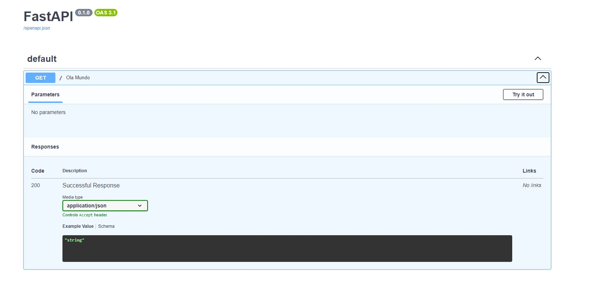
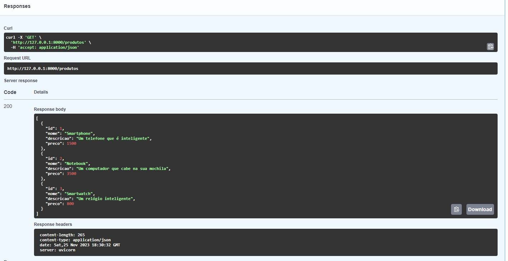
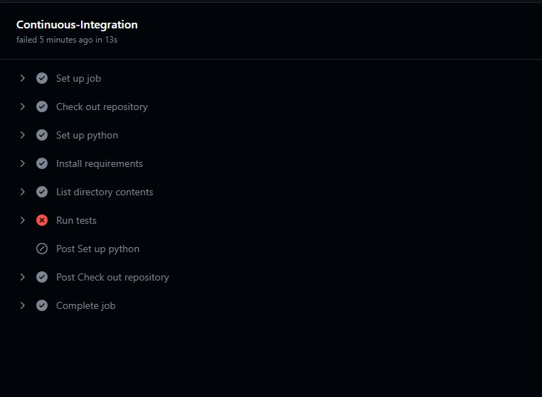
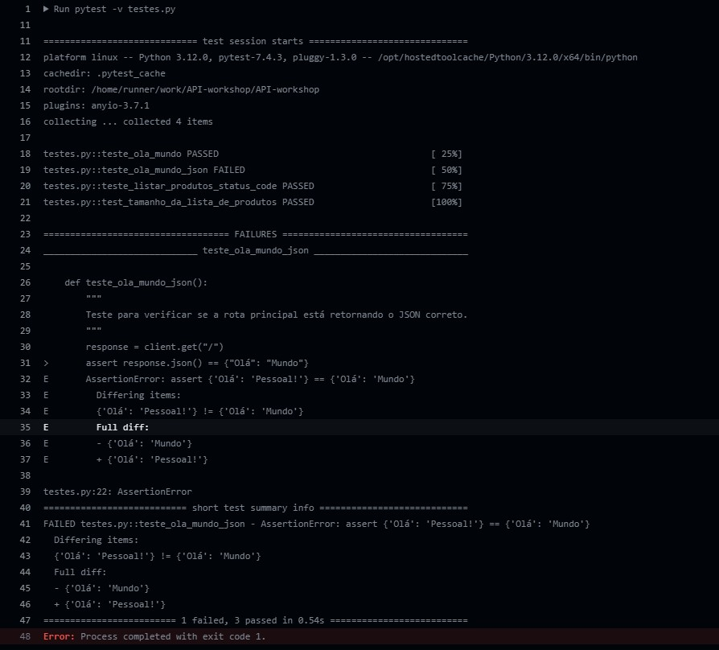
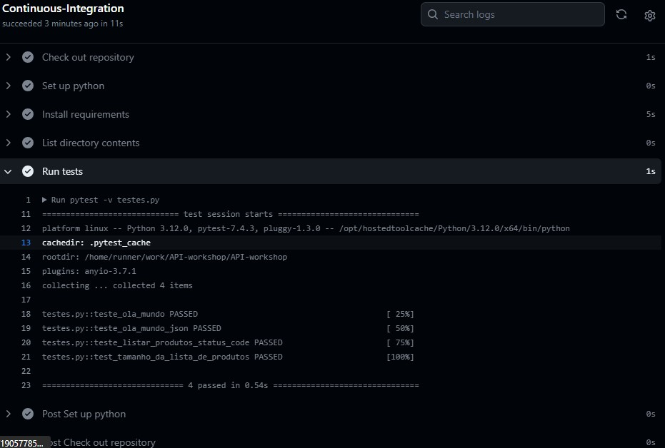
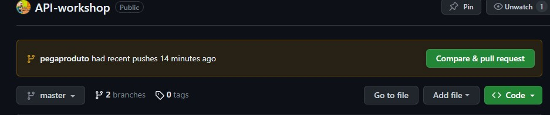
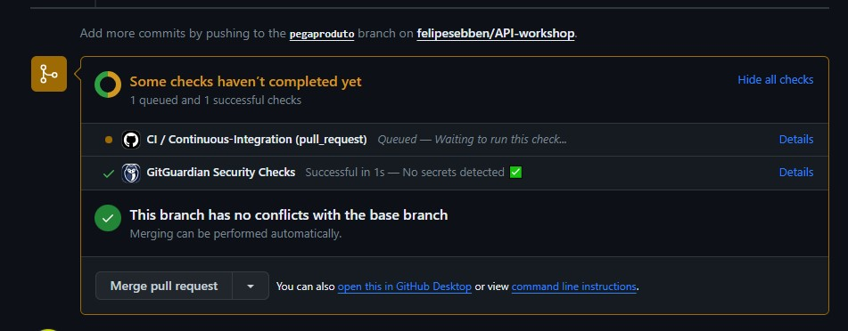
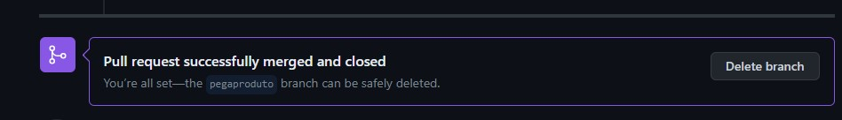
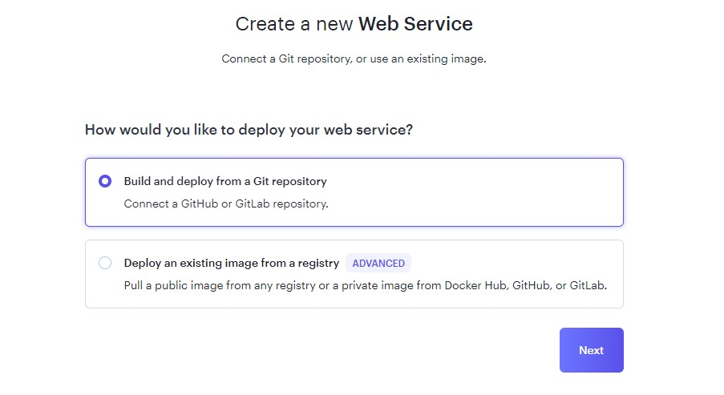

# Workshop | Do Jupyter Notebook pro Deploy em Produção | API


# Introdução

Esta é a **primeira** etapa da nossa workshop (ver link de referência abaixo), que lida com os principais tipos de projetos na área de dados e como implementar o deploy em produção desses tipos.  A ideia, portanto, é mostrar os **principais produtos de dados.** Ao implementar todas as etapas (API, instância Postgres, Dashboard, data quality, monitoramento). o objetivo é ter um conhecimento não apenas do frontend em dashboard ou do backend, sem saber como os dados são consumidos.

## Ordem de tarefas:


Tarefas a serem implementadas. Imagem por Luciano Galvão.

O que vamos implementar neste repositório?

- [x] **API**
- [x]  ***CRUD***
- [ ]  Subir instância no banco
- [ ]  ****Datadog****
- [ ]  ****Airflow****

### Repositório central do projeto de referência:

[Link para repositório](https://github.com/lvgalvao/Do-Jupyter-Notebook-Pro-Deploy)


# 1. Criando nossa API

**Repositório de referência para criação de API:**

[Link para repositório](https://github.com/lvgalvao/API-Do-Jupyter-Notebook-Pro-Deploy)

API é uma forma de comuncar-se entre máquinas ****sem**** usar o frontend. Uma faz o ****request****, enquanto a outra executa a *resposta*, devolvendo-a ao cliente.

## 1.1 APIs e contratos


O contrato na API. Imagem por Luciano Galvão.

Os **contratos** na API são eficientes ao evitar que seu banco fique **sujo**. De maneira similar aos schemas de SQL, previnem a inserção de dados que não cumpram as regras de formatação e de tipos de dados impostas. Um exemplo seria impedir a conclusão de um cadastro que deixe o endereço de e-mail vazio.

Para nosso projeto, vamos usar a **FastAPI**. Pode-se usar django e Flask também para quem é mais do backend, mas, nesse caso, usaremos  a FastAPI.

## 1.2 Criando o ambiente virtual

Vamos utilizar o pacote **poetry** para gerenciar nossas dependências.

```powershell
poetry init
```

Após criar nosso projeto poetry, vamos ativar nosso ambiente virtual e instalar o ****taskipy****.

```powershell
poetry shell
```

Em seguida, configuramos nosso `.gitignore` para ignorar partes do projeto que não desejamos subir para nosso repositório, como o `.venv` , que contém mais de 200mb.

```powershell
ignr -p python > .gitignore
```

OBS: caso tu não tenhas o `ignr` , instale-o usando o pip:


```powershell
pip install ignr
```

## 1.2 Instalando o FastAPI

O FastAPI, conforme mencionado, é um framework para criação de APIs RESTful com Python. Ele faz as rotas, os requests, bem como as responses.

```powershell
poetry add fastapi
```

## 1.3 Instalando o Uvicorn

O Uvicorn é o servidor **assíncrono que fica por trás do API.** Ele é quem processa as chamadas do FastAPI.

```powershell
poetry add uvicorn
```
> 💡 **FastAPI + Uvicorn = sempre juntos!**

## 1.4 Criar primeiro endpoint

Na sintaxe de APIs, endpoints são **pontos de acesso,** definidos por:

- URL + método + parâmetros

```python
from fastapi import FastAPI

# Criar instância do FastAPI
app = FastAPI()

# Criar rota principal
@app.get("/")   # Request
def ola_mundo(): # Response
    return {"Olá": "Mundo"}
```

## 1.5 Executar o servidor

Para executar nosso servidor, vamos iniciar o **uvicorn** com o seguinte comando:

```powershell
uvicorn main:app --reload
```

Aqui, chamamos nosso arquivo `main.py`  com `--reload`.** No entanto, caso sua porta esteja em uso, pode ocasionar um aviso de problema. É aí que entra o *taskipy.*

Antes de colocar nosso servidor em funcionamento, vamos instalar o pacote **taskipy,** que faz **automação de atividades**. Ele faz coisas chatas de forma mais fácil.

```powershell
poetry add taskipy
```

Por que vamos usá-lo? Porque podemos criar tasks dentro do nosso arquivo `pyproject.toml` :

```toml
[tool.taskipy.tasks]

run = "uvicorn main:app --reload"
test = "pytest -v"
kill = "kill -9 $(lsof -t -i:8000)"
```

Assim, caso sua porta esteja presa, basta utilizar o comando…

```powershell
task kill
```

… e a porta 8000 estará liberada!

Feito esses passos e com o servidor em execução, basta acessá-lo pelo ip e porta disponibilizados no terminal ([http://127.0.0.1:8000](http://127.0.0.1:8000/docs))

>*Sensacional:* acesse o servidor e adicione [http://127.0.0.1:8000/docs](http://127.0.0.1:8000/docs) para ter acesso à ****documentação automaticamente gerada**** pelo FastAPI!

<figure>
    
    <figcaption>Exemplo de documentação automaticamente gerada.</figcaption>
</figure>

É possível praticar e treinar as endpoints disponibilizadas ***sem*** descasar a API de sua documentação!

## 1.6 Criando testes

Vamos instalar o pacote **pytests** para realizar testes nas nossas aplicações.

No nosso caso, houve um `ModuleNotFoundError: No module named 'httpx'`. Basta instalar o pacote com o poetry.

```powershell
poetry add httpx
```

Cria-se um arquivo testes.py.

```bash
touch testes.py
```

Agora, criamos os testes unitários para nosso código.

```python
import pytest

from fastapi.testclient import TestClient # Servidor de testes do FastAPI

from main import app

client = TestClient(app)

def teste_ola_mundo():
    """
    Teste para verificar se a rota principal está funcionando.
    """
    response = client.get("/")
    assert response.status_code == 200 # Verifica se o status code é 200


def teste_ola_mundo_json():
    """
    Teste para verificar se a rota principal está retornando o JSON correto.
    """
    response = client.get("/")
    assert response.json() == {"Olá": "Mundo"}
```

Em seguida, rodamos os testes para ver se nosso código passa pelas condições.

```bash
pytest -v tests.py
```

Agora, não queremos que nossos testes parem de funcionar. O que fazer?

- Criamos uma pasta `.github`
    - Dentro dela, criamos uma pasta `workflows`.
    - Por fim, criamos um arquivo `main.yml` .

O que esse `main.yml`faz? Ele vai falar para o GitHub uma ****sequência de passos**** que queremos que sejam feitos cada vez que um pull request seja feito.

```yaml
name: CI

on: pull_request

jobs:
  Continuous-Integration:
    runs-on: ubuntu-latest
    steps:
      - name: Check out repository
        uses: actions/checkout@v3

      - name: Set up python
        id: setup-python
        uses: actions/setup-python@v4
        with:
          python-version: '3.12'

      - name: Install requirements
        run: pip install -r requirements-dev.txt

      - name: List directory contents
        run: ls -la

      -name: Run tests
        run: pytest -v testes.py
```

Aqui, solicitamos para cada ***pull request:***

- Criamos um ***job Continuous-Integration***.
- Solicitamos que suba uma máquina **ubuntu na versão mais recente**.
- Checar o **respositório**.
- Configurar uma versão de **Python**.
- Instalar os requirements de ****requirements-dev.txt****.
- Listar o conteúdo do diretório.
- Rodar testes.

<aside>
💡 É sempre uma boa ideia ter *dois requirements*, um para o  *ambiente de dev* e outro para o ambiente de desenvolvimento.  Quando o deploy for feito, sobe-se apenas o `requirements.txt` , pois este não precisa de vários pacotes e bibliotecas.

</aside>

Feitas as alterações nos requirements, podemos fazer nosso primeiro **commit** e push para o repositório. É chegada a hora de…

### 1.7 Criar nossa segunda view

Vamos criar uma nova branch `produtos`.

```bash
git switch -c produtos
```

Vamos criar alguns produtos em hard code mesmo:

```python
from fastapi import FastAPI
from typing import Dict, List

# Criar instância do FastAPI
app = FastAPI()

produtos: List[Dict[str, any]] = [
    {
        "id": 1,
        "nome": "Smartphone",
        "descricao": "Um telefone que é inteligente",
        "preco": 1500.00,

    },
    {
        "id": 2,
        "nome": "Notebook",
        "descricao": "Um computador que cabe na sua mochila",
        "preco": 3500.00,
    },
    {
        "id": 3,
        "nome": "Smartwatch",
        "descricao": "Um relógio inteligente",
        "preco": 800.00,
    },
]
```

Cria-se, na sequência, uma rota para trazer essa lista de produtos.

```python
# Criar novo endpoint de lista de produtos
@app.get("/produtos")
def listar_produtos():
    """
    Retorna lista de produtos.
    """
    return produtos
```

A partir daqui, podemos acessar nossa lista de produtos em nossa API. Com o terminal em poetry, rode:

```powershell
task run
```

…para rodar o uvicorn. a rota `/produtos` estará disponível e documentada no `/docs`!

<figure>
    
    <figcaption>Endpoint /produtos adicionada ao FastAPI com documentação gerada automaticamente!</figcaption>
</figure>


Criamos, também, alguns testes para esse get também. O ideal é fazer testes para cada endpoint.

```python
def teste_listar_produtos_status_code():
    """
    Teste para verificar se a rota de listagem de produtos está funcionando.
    """
    response = client.get("/produtos")
    assert response.status_code == 200 # Verifica se o status code é 200

def test_tamanho_da_lista_de_produtos():
    """
    Teste para verificar se a rota de listagem de produtos está retornando a lista correta.
    """
    response = client.get("/produtos")
    assert len(response.json()) == 3 # Verifica se a lista tem 3 itens
```

Rodamos, daí, o pytest para verificar que nossas endpoints passam no teste:

```python
pytest -v testes.py
```

**Por que é importante realizar esses testes?**

Digamos, por exemplo, que o time de backend tenha mudado, e que alguém mudou uma das funções de um dos endpoints. Em seguida, é feito um commit que informa essa alteração. Com os testes, **impede-se** essa alteração num pull request à master sem qualquer verificação.  Continuous Integration nada mais é que isso: **criar barreiras para não afetar a tua main!**

Para reproduzir a importância de testes, foi criado, na branch `produtos`, um erro proposital na função `teste_ola_mundo()`. Subiu-se o código e requeriu-se um merge com a `master`. **É nessa hora que o GitHub actions brilha.** Primeiro, após feita a *pull request*, a solicitação passa pela rotina que criamos no yaml:

- Na ação de `pull request` e em uma máquina ubuntu:
    - checkout do repo
    - configurar python
    - instalar os requirements
    - listar o conteúdo do diretório
    - rodar os testes do *testes.py*

Eis os resultados do actions:

<figure>
    
    <figcaption>O <b>erro</b> ao rodar os testes…</figcaption>
</figure>


<figure>
    
    <figcaption>… e a <b>descrição</b> do erro no teste: `“Pessoal!”` em vez de `“Mundo”`.</figcaption>
</figure>
Nesse cenário, o dev, com o rabo entre as pernas, volta para sua branch e corrige o erro. Eis a importância: nossa master/main ficou ilesa, sem ser afetada pelo erro! Ver abaixo os testes passando:


<figure>
    
    <figcaption>Testes aprovados.</figcaption>
</figure>


> 💡 A prática de CI também conta com o **GitGuardian**. Ele verifica se nenhuma senha está sendo exposta e impede que dados sensíveis subam para o repositório!

Resolveu o problema? Mata a branch agora! Podemos deletar a `produtos` no Github. No bash:

```bash
git switch master
```

```bash
git pull
```

…e  voilà, nossa main está corretinha e com o endpoint criado na branch adicionado sem erro nenhum.

E essa é lógica de CI e desenvolvimento. Mantemos nossa main limpinha, criamos novas branches, e vamos implementando testes para evitar a contaminação de erros para a principal. Vamos, agora, criar outro produto em uma nova branch, `pegaproduto`.


> ❓ Aliás, devemos fazer uma branch por ticket?
> - Recomenda-se que **sim.** Demora um pouco mais, mas a **rastreablidade** é maior.

## 1.8 Criando mais uma endpoint

E seguimos a rotina de ir desenvolvendo e *testando*:

- Criar nova endpoint `produtos/{id}` :

```python
# Criar novo endpoint para produto específico
@app.get("/produtos/{id}")
def buscar_produto(id: int):
    """
    Retorna produto específico.
    """
    for produto in produtos:
        if produto["id"] == id:
            return produto
    return {"Status": 404,
            "Mensagem": "Produto não encontrado."}
```

- Criar novo teste:

```bash
def test_pega_um_produto():
    """
    Teste para verificar se a rota de busca de produto está funcionando.
    """
    response = client.get("/produtos/1")
    assert response.json() == {
        "id": 1,
        "nome": "Smartphone",
        "descricao": "Um telefone que é inteligente",
        "preco": 1500.00,
    }
```

- Fazer o push:

```bash
git push
```

- Fazer a pull request e aplicar as checagens do GitHub Actions + GitGuardian…





- … e aprovar a merge e deletar a branch. Basta, em seguida, fazer o `git pull` para a master e tá feito!



## 2. É hora do **deploy com Render!** ##

Vamos usar o **Render**, que tem um free tier sem um cartão de crédito! Para coisas leves, que não precisam, por exemplo, de um airflow, ele é excelente! Em outras palavras, o render é um ****provedor de cloud****, tipo um AWS baratinho.

[Link Render](https://render.com/)

Após criar conta, vamos em ****create a web service****, que já, gloriosamente, nos permite a opção de nos conectar a uma conta GitHub.



Após autorizar o render no teu GitHub, selecionar o repositório do projeto e clicar em *connect*.

Ao criar o serviço, na linha de comando a ser executado, passar:

```bash
uvicorn main:app --host 0.0.0.0 --port 8000
```

Rode o serviço e…

<figure>
    
    <figcaption>A API viva na nuvem com Render.
</figcaption>
</figure>

…eis nossa API rodando na nuvem! E o que é mais legal: como o render está **vinculado ao nosso GitHub**, alterações no repo serão repassados nele! Para acessar nossa api, bem como os docs dela, basta usar a url que criamos! Temos então um **auto-deploy** muito massa - sempre que tivermos algo na main/master, ele atualiza!

# 3. Refatorando e revalidando com Pydantic

Criamos nova branch `pydantic` e refatorar nosso código. Nosso objetivo é:

- Organizar nosso código em pastas.
- Separar nosso código, dividindo-os em testes no lugar de testes, dados no lugar de dados, classes no lugar de classes, e assim vai.

> ⚠️ Lembre-se de no `pyproject.toml` de adicionar `app.` no comando `run`:
`run = “uvicorn app.main:app —reload”`


Ao refatorar os testes na pasta tests, lembre-se, também, de adicionar um arquivo `__init__.py`, pois a pasta tem que ser tratada como módulo.

O Pydantic possui muitas atribuições e funcionalidades. Eis o link para a *documentação* dele:

[Documentação Pydantic](https://docs.pydantic.dev/latest/)

No nosso caso, o empregamos para validar a inserção de dados na API - passo crucial ao criarmos nossa rota ***POST***:

```python
from pydantic import BaseModel, PositiveFloat
from typing import Optional

class ProdutosSchema(BaseModel):
    """
    Modelo de dados para produtos.
    """
    id: int
    nome: str
    descricao: Optional[str] = None
    preco: PositiveFloat
```

Aqui, observa-se o uso da classe `BaseModel` do pydantic para validar a classe que criamos. Nesse caso, o usuário pode apenas, por exemplo, inserir valores positivos em `preco`.  Genial! Podemos fazer todas essas validações antes que a API chegue ao banco!

> ⚠️ Lembrar de mudar algumas partes do código.
No main.yml, mude o *run* do **step `Run tests`** para `run: pytest -v` somente.
Acrescente as bibliotecas novas ao ****requirements.txt****

## 3.1 Criando um endpoint POST

Como o browser não permite a inserção de dados, vamos criar uma rota POST que permite que inserçamos dados pela nossa API.

```python
@app.post("/produtos", response_model=ProdutosSchema)
def adicionar_produto(produto: ProdutosSchema):
    """
    Adiciona novo produto.
    """
    return lista_de_produtos.adicionar_produtos(produto.model_dump())
```

De igual maneira, criamos barreiras para impedir que valores não válidos sejam inseridos - kudos to pydantic, mais uma vez.  Uma validação dessa função também é incluída nos nossos testes, como de praxe.

## 3.2 Adicionando o tipo de retorno Pydantic

Apenas como complemento, observe o código abaixo, que descreve uma das nossas rotas:

```python
# Criar novo endpoint de lista de produtos
@app.get("/produtos", response_model=list[ProdutosSchema]) # Schema  de resposta
def listar_produtos():
    """
    Retorna lista de produtos.
    """
    return lista_de_produtos.listar_produtos()
```

Foi acrescentado ao decorador o parâmetro `response_model`, que pode ser usado em qualquer operação (get, post, put, delete) para pré-definir os tipos de dados a serem inseridos conforme o modelo pydantic desenvolvido. E mais: a FastAPI irá utilizar o `response_model`para produzir a documentação e a validação dos dados, além de ****converter e filtrar**** os dados conforme o definido na classe pydantic (`ProdutosSchema`)!

É hora agora de dar um pause nessa branch, dar uma testadinha no nosso código com `task test` e fazer a merge com nossa master/main.

## 3.3 Verificar se nossa API tá rodando ainda!

É hora de ver se o deploy tá funcionando no Render. Spoiler: ****não estará!**** Isso porque temos que alterar o path do nosso uvicorn no Settings da nossa API para:

```bash
uvicorn app.main:app --host 0.0.0.0 --port 8000
```

# 4. Resumo do que fizemos (ainda tem mais…)

Chegamos longe! Nossa API conta com:

- **Versionamento** (duh).
- Documentação + endpoints com **FastAPI**.
- Ambiente gerenciado com **Poetry**.
- Tasks rodadas com **taskipy**.
- Rotina de testes com **pytest** + **GitHub actions**.
- Deploy com **render**.
- Controle de qualidade + documentação com *Pydantic*.

E o que é mais legal? Nossa API está rodando bonitinha, disponível **com a minha máquina desligada**, para qualquer um testar. **Mas…**
O que formos colocar na API ainda não está sendo armazenada - nossos produtos estão em hard code no script de dados, e o que colocamos no POST tampouco está sendo armazenado. Nos falta um banco de dados! E é o que vamos fazer em um repositório à parte.


# 5. De volta às APIs | Refatorando

É hora de mudar bastante nosso código. Vamos criar nova branch e deletar nosso `data.py`, pois nossa API irá fazer todo o CRUD junto ao banco que criaremos no Render.

```bash
git switch -c database
```

## 5.1 O `config.py` ##

Essa parte do projeto costuma ter outros nomes também - database, db, etc. Vamos ver como ele fica:

```python
from sqlalchemy import create_engine, Column, Integer, String, Float
from sqlalchemy.orm import sessionmaker, declarative_base

import os
from dotenv import load_dotenv

load_dotenv(dotenv_path=".env.prod")  # Carrega as variáveis de ambiente do arquivo .env

db_user = os.getenv("POSTGRES_USER")
db_password = os.getenv("POSTGRES_PASSWORD")
db_name = os.getenv("POSTGRES_DB")
db_host = os.getenv("DB_HOST")
db_port = os.getenv("DB_PORT")

# Configurar a conexão com o banco de dados
DATABASE_URL = f"postgresql://{db_user}:{db_password}@{db_host}:{db_port}/{db_name}"
# print(DATABASE_URL)
# Criar a engine de conexão
engine = create_engine(DATABASE_URL)

# Criar fábrica de sessões do SQLAlchemy que será usada para criar sessoẽs
SessionLocal = sessionmaker(bind=engine, autoflush=False, autocommit=False)

Base = declarative_base()

# Definir função geradora que fornecesse sessão de dados e garante o fechamento da sessão
def get_db():
    """
    Cria uma sessão de banco de dados para uso no decorrer da requisição.
    """
    db = SessionLocal()
    try:
        yield db
    finally:
        db.close()
```

De novo, definimos uma sessão que é aberta e fechada quando a usamos.

## 5.2 O `model.py`

Estamos seguindo a lógica de camadas para separar nosso código. Aqui, temos o **modelo de criação de tabelas**. Definimos a **estrutura** de tabela para a ORM fazer a query. Assim, nosso sqlalchemy irá usar esse modelo para **criar a tabela**. O pydantic é para **validação**. Olha só:

```python
from sqlalchemy import Column, Integer, String, Float
from sqlalchemy.orm import declarative_base

Base = declarative_base()

# Criar classe Produto que herda de Base
class Produto(Base):
    __tablename__ = "produtos"

    id = Column(Integer, primary_key=True, index=True)
    titulo = Column(String, nullable=False)
    descricao = Column(String)
    preco = Column(Float, nullable=False)

    class Config:
        from_attributes = True
```

> ⚠️ Lembre-se de checar o schema que foi criado na etapa anterior (ver etapa de criação de banco). O modelo declarativo que formos desenvolver deve bater co o que foi criado no banco - *inclusive o nome das colunas**! É aqui que o ******dba****** e o **************backend************** batem a cabeça heheh então, não perca teu tempo de maneira desnecessária e compare com o que estiver no banco!


### 5.3 O `[routes.py](http://routes.py)` - o nosso CRUD!

 Vamos tirar todas as nossas rotas que estão na main e colocá-las nesse script. Lembre-se no `[main.py](http://main.py)` de importar esse módulo! Vamos primeiro olhar o routes.

```python
from fastapi import APIRouter, Depends, HTTPException
from sqlalchemy.orm import Session
from typing import List

from app.schema import ProdutosSchema
from app.config import SessionLocal, get_db
from app.model import Produto

router = APIRouter()

# Criar rota principal
@router.get("/")  # Request
def ola_mundo():  # Response
    return {"Olá": "Mundo"}

# Criar novo endpoint de lista de produtos
@router.get("/produtos", response_model=List[ProdutosSchema])  # Schema  de resposta
def listar_produtos(db: Session = Depends(get_db)):
    """
    Retorna lista de produtos.
    """
    return db.query(Produto).all()  # = SELECT * FROM produtos

# Criar novo endpoint para produto específico
@router.get(
    "/produtos/{produto_id}", response_model=ProdutosSchema
)  # Schema  de resposta
def buscar_produto(produto_id: int, db: Session = Depends(get_db)):
    """
    Retorna produto específico.
    """
    produto = db.query(Produto).filter(Produto.id == produto_id).first()
    if produto:
        return produto
    else:
        raise HTTPException(status_code=404, detail="Produto não encontrado")

@router.post("/produtos", response_model=ProdutosSchema)
def adicionar_produto(produto: ProdutosSchema, db: Session = Depends(get_db)):
    """
    Adiciona novo produto.
    """
    db_produto = Produto(**produto.model_dump())
    db.add(db_produto)
    db.commit()
    db.refresh(db_produto)
    return db_produto

@router.delete("/produtos/{produto_id}", response_model=ProdutosSchema)
async def remover_produto(
    produto_id: int, db: Session = Depends(get_db)
):  # Async para rodar em background
    """
    Remove produto.
    """
    produto = db.query(Produto).filter(Produto.id == produto_id).first()
    if produto:
        db.delete(produto)
        db.commit()
        return produto
    else:
        raise HTTPException(status_code=404, detail="Produto não encontrado")

@router.put("/produtos/{produto_id}", response_model=ProdutosSchema)
def atualizar_produto(
    produto_id: int, produto_data: ProdutosSchema, db: Session = Depends(get_db)
):
    """
    Atualiza produto.
    """
    db_produto = db.query(Produto).filter(Produto.id == produto_id).first()
    if db_produto:
        for key, value in produto_data.model_dump().items():
            setattr(db_produto, key, value) if value else None
        db.commit()
        db.refresh(db_produto)
        return db_produto
    else:
        return HTTPException(status_code=404, detail="Produto não encontrado")
```

Criamos, primeiro, o ************router************, que fará um direcionamento das rotas. Substituímos nos decoradores o `ap` por `@router`.


> ⚠️ Rota, endpoint, view = **mesma coisa**!

Teremos que tirar todo o trabalho de lista de função e colocar o **sqlalchemy** nelas. Precisamos, de padrão, saber qual o banco de dados estamos usando. Para isso, importamos o `ProdutosSchema`. Vamos usar o `get_db()` que criamos na config, que nos tira o trabalho de ter que ficar e fechando sessões em cada função.

Observe a mudança nas funções. `obter_produto()`, por exemplo, recebe o `produto_id`, inicia a sessão. Dentro do banco, faz-se a query, filtrando pelo id, buscando o primeiro, retornando `“produto não encontrado”` caso não seja bem-sucedido. E olha que interessante o `response_model=ProdutosSchema` : é a classe que criamos com o **pydantic**, que valida os dados nas operações CRUD que criamos com as APIs.

# 6. Criar um banco gratuito no render!

É hora de libertarmo-nos do nosso banco em máquina local e subir às nuvens! O render nos permite criar um banco Postgres gratuito. Vamos:

- **Deletar** nossa instância anterior.
- **Subir** uma nova instância usando as variáveis que detrminamos loclmente.
- Ir em  > PostgreSQL
    - Name: `postgres-deploy`
    - Database: `meu_banco`
    - User: `meu_usuario`
- Selecione a versão Free (**sem** necessidade de cartão de crédito). Temos direito a uma instância de 250mb de RAM + storage de 1GB.

Agora, vá para as anotações de [Workshop | Do Jupyter Notebook pro Deploy em Produção | Banco de Dados](https://www.notion.so/Workshop-Do-Jupyter-Notebook-pro-Deploy-em-Produ-o-Banco-de-Dados-f77a405d460e4c899e68b63a7631c602?pvs=21) e siga de lá momentaneamente.

---

# 7. Criar as variáveis de ambiente

Tal qual nossa aplicação para banco, crie os `.env.prod` e `.env.dev` e passe as respectivas variávies de ambiente. As do render devem estar em produção, enquanto as locais, no de dev.

> ⚠️ Certifique-se que as variáveis estejam na **pasta raiz** caso contrário, o `load_dotenv(path=)` não irá encontrá-las!

# 8. Colocar as variáveis no render

No dashboard da nossa `api-workshop` (ou do nome qe t tenhas colocdo), vá em mentdd secret file que armazena nossas variáveis da `.env`.

# 9. Testar o deploy da API!

Feito isso, o render irá atualizar e verificar as condições para o novo **deploy** Clique na instância da API, selecione **Dploy latest commit**. Cruze os dedos (importante) e espere a confirmação do deploy no terminal. Se tudo der certo, acesse a url da API e faça uns testes de cada endpoint.

Feito iso, podemos:

 Deletar nossa magem postgres- Deletar a instância referente no ***render.**

# 10. Conclusão

Nossa, que evolução. O que temos até agora?

- Uma API que executa todo o CRUD.
- Um banco Postgres que armazena osendpoints das APIs.- E tudo ***disponível online**, sem necessidade de nehuma ***máquina estar rodando***.
- Bônus enorme do pytests, pydantic, testes CI (tema de casa!),e pr-commit para garantir a alityo próximo passo, em um outro repositório, é implementar a orquestração e, para tanto, vamos de **Airflow**!
---
